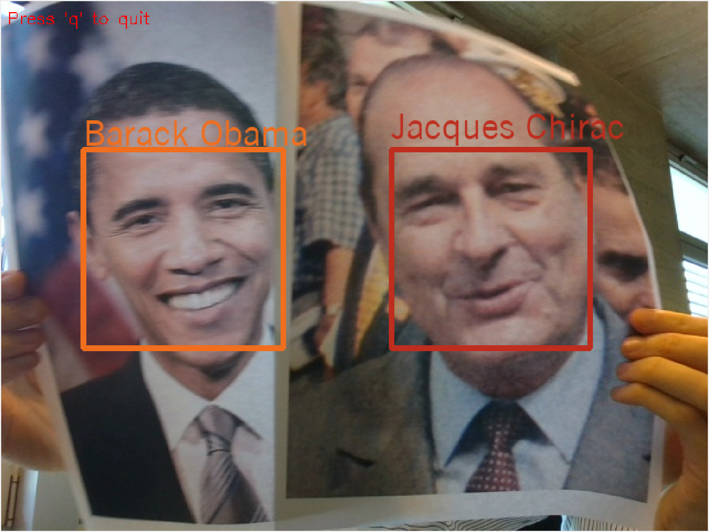

# Openface classifier in Pytorch

This is a pytorch code to use the
[openface](https://github.com/cmusatyalab/openface) model. This code
is adapted from
[OpenFacePytorch](https://github.com/thnkim/OpenFacePytorch).


## Installation

After cloning this repository activate your base conda environment and
run (you should adapt the versions of `cudatoolkit` based on your
NVIDIA driver):

```bash
cd pytopenface/
conda env create -v -f conda/py27-cu100.yaml # For Python 2.7
# conda env create -v -f conda/py37-cu101.yaml # For Python 3.7
conda activate pytopenface
```

The Dlib facial landmarks model can be downloaded like this:

```
wget http://dlib.net/files/shape_predictor_68_face_landmarks.dat.bz2
bunzip2 shape_predictor_68_face_landmarks.dat.bz2
```

## Activating the environment

You can use the library in 2 ways. Assuming that repository
"pytopenface" is cloned in `/PATH/TO/DIR`

1. Either using `pip install -e`:

   ```bash
   conda activate pytopenface
   cd /PATH/TO/DIR
   pip install -e ./pytopenface
   ```

2. Either by setting `PYTHONPATH`:

   ```bash
   conda activate pytopenface
   export PYTHONPATH=/PATH/TO/DIR
   ```

## Basic demo

Once your environment is activated,

```bash
python examples/test_pyopenface_webcam.py --source data/webcam/list.txt
```

|  |  |
|------------------------------------------------------|------------------------------------------------------|
| Image displayed                                      | Matches in the database                              |


## Testing with your own images

Once your environment is activated,

```
python examples/test_pyopenface_webcam.py  \
    --dlib-model <PATH-TO>/shape_predictor_68_face_landmarks.dat  \
    --face-book <PATH-TO>/persons.lst \
    --reid-threshold 0.7 \
    --source 0 \ # Camera ID for OpenCV, here webcam
    --show-closest 2
```

where `persons.lst` should look like

```
name Name of person 1
/absolute/path/to/images/person_1_1.png
/absolute/path/to/images/person_1_2.jpg
/absolute/path/to/images/person_1_3.jpg
name Name of person 2
/absolute/path/to/images/person_2_1.png
name Name of person 3
/absolute/path/to/images/person_3_1.png
/absolute/path/to/images/person_3_2.png
/absolute/path/to/images/person_3_3.png
/absolute/path/to/images/person_3_4.png
```

And the images should contain the faces of the persons.

The `--threshold` is the limit below which a match is considered
between two images of a face:
- if `distance(image_1, image_2) < threshold`, we decide the two
  images are of the same person.
- if `distance(image_1, image_2) > threshold`, we decide the two
  images are of different identities.
